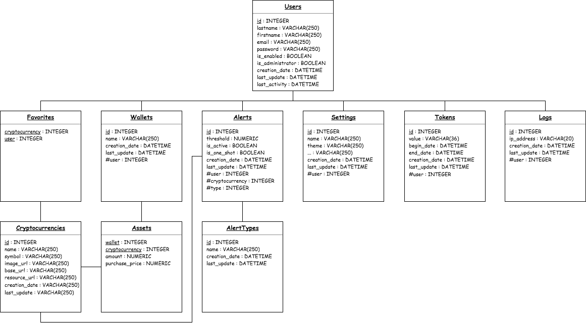

# Polytech-CryptoWallet-Backend

## Members
- DELORME Loïc
- KASPRZYK Nicolas
- LAFAYE DE MICHEAUX Yoan

## Global database scheme


## Getting started
- Clone Polytech-CryptoWallet-Backend project
```
cd [YOUR WORKSPACE]
git clone https://github.com/LoicDelorme/Polytech-CryptoWallet-Backend.git
```

- Launch Docker containers
```
cd Polytech-CryptoWallet-Backend/
docker-compose up -d
```